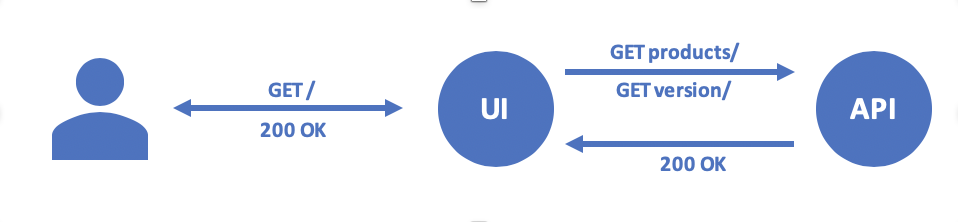

# Consul vagrant

Consul is a networking tool that provides a fully featured service-mesh control plane and service discovery. Consul also includes a key-value store for service configuration.

## Main concepts covered in this training

### Consul Datacenters

One of the key features of Consul is its support for multiple datacenters. The architecture of Consul is designed to promote a low coupling of datacenters so that connectivity issues or failure of any datacenter does not impact the availability of Consul in other datacenters. This means each datacenter runs independently, each having a dedicated group of servers and a private LAN.

### Multi-Cluster Federation

In Consul, federation is the act of joining two or more Consul datacenters. When datacenters are joined, Consul servers in each datacenter can communicate with one another. This enables the following features:

- Services on all clusters can make calls to each other through Consul Service Mesh.
- Intentions can be used to enforce rules about which services can communicate across all clusters.
- L7 Routing Rules can enable multi-cluster failover and traffic splitting.
- The Consul UI has a drop-down menu that lets you navigate between datacenters.

### Service Discovery and Health Checking

One of the major use cases for Consul is service discovery. Consul provides a DNS interface that downstream services can use to find the IP addresses of their upstream dependencies.

Consul knows where these services are located because each service registers with its local Consul client. Operators can register services manually, configuration management tools can register services when they are deployed, or container orchestration platforms can register services automatically via integrations.

Checks are useful for monitoring the state of your services inside your datacenter and can be applied to many different use cases. Ultimately, Consul leverages checks to maintain accurate DNS query results by omitting services and nodes that are marked unhealthy.

### Consul Connect

Consul Connect provides service-to-service connection authorization and encryption using mutual Transport Layer Security (TLS). Applications can use sidecar proxies in a service mesh configuration to establish TLS connections for inbound and outbound connections without being aware of Connect at all. Applications may also natively integrate with Connect for optimal performance and security. Connect can help you secure your services and provide data about service-to-service communications.

### Mesh gateways

Mesh gateways enable routing of Connect traffic between different Consul datacenters. Those datacenters can reside in different clouds or runtime environments where general interconnectivity between all services in all datacenters isn't feasible. These gateways operate by sniffing the SNI header out of the Connect session and then route the connection to the appropriate destination based on the server name requested. The data within the mTLS session is not decrypted by the Gateway.

### Consul Template

Consul Template queries a Consul instance and updates any number of specified templates on the filesystem. As an added bonus, Consul Template can execute arbitrary commands when a template update completes.

The Consul template tool provides a programmatic method for rendering configuration files from a variety of locations, including Consul KV. It is an ideal option for replacing complicated API queries that often require custom formatting. The template tool is based on Go templates and shares many of the same attributes.

### Monitoring

Consul Monitoring is an important part of comprehensive infrastructure and microservice performance management.

InfluxDB open source time series database, purpose-built by InfluxData for monitoring metrics and events, provides real-time visibility into stacks, sensors, and systems. Use InfluxDB to capture, analyze, and store millions of points per second, meet demanding SLA’s, and chart a path to automation.

Grafana is a multi-platform open source analytics and interactive visualization web application. It provides charts, graphs, and alerts for the web when connected to supported data sources. It is expandable through a plug-in system. End users can create complex monitoring dashboards using interactive query builders.

### Nomad
Nomad is a flexible workload orchestrator to deploy and manage containers and non-containerized applications across on-prem and clouds at scale. It enables an organization to easily deploy and manage any containerized or legacy application using a single, unified workflow. Nomad can run a diverse workload of Docker, non-containerized, microservice, and batch applications.

Nomad enables developers to use declarative infrastructure-as-code for deploying applications. Nomad uses bin packing to efficiently schedule jobs and optimize for resource utilization. Nomad is supported on macOS, Windows, and Linux.

## In this Project

### Architecture

### Services interaction

